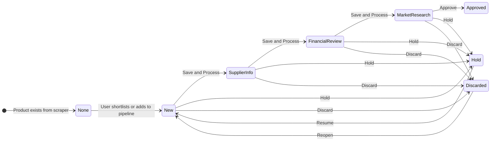

# E-commerce BI Platform — Functional Specification (V3 Rebuild)

> This document captures **what** the program does, not how. Use as the blueprint for a ground-up rebuild with improved UX, performance, and robustness.

---

## 1. Domain Model

### Core Entities & Relationships

```mermaid
erDiagram
    PARSER ||--o{ PRODUCT : "scrapes into"
    PRODUCT ||--o{ STOCK_HISTORY : "has"
    PRODUCT ||--o{ PRICE_HISTORY : "has"
    PRODUCT ||--o| PIPELINE_DETAIL : "has 0 or 1"
    PRODUCT }o--o{ PRODUCT_CATEGORY : "assigned to M2M"
    PRODUCT }o--o| PRODUCT_GROUP : "belongs to 0 or 1"
    PARSER ||--o{ PARSER_RUN_LOG : "logs each run"
    PARSER }o--o| PARSER_CATEGORY : "assigned to 0 or 1"

    PRODUCT {
        int id PK
        string original_id UK "external ID from scraper"
        string name
        string url "source store URL"
        string image "product image URL"
        string slug
        string vendor "brand or vendor name"
        string stock_policy
        int parser_id FK
        string parent_id "variant grouping"
        bool shortlisted "watchlist flag"
        string pipeline_status "None or New or Supplier Info or Financial Review or Market Research or Approved or Hold or Discarded"
        string sales_ranking "High or Good or Slow or Poor"
        int group_id FK
    }

    PIPELINE_DETAIL {
        int product_id PK_FK
        string title "custom title override"
        jsonb variants "array of variant objects"
        string sku "auto-generated GD-CategoryCode-ProductId"
        string barcode "auto-generated EAN-13"
        text specs
        decimal retail_price "RON"
        text factory_link_url
        decimal cogs_usd "Cost of Goods Sold in USD"
        decimal transport_usd "per-unit transport in USD"
        decimal dimension_width_cm
        decimal dimension_length_cm
        decimal dimension_height_cm
        decimal cubic_meters
        decimal customs_rate_percentage "EU customs duty pct"
        string hs_code "10-digit EU TARIC code"
        text top_keywords
        string keyword_difficulty
        text main_competitors
        text market_research_insights
        int suggested_quantity_min
        int suggested_quantity_max
        decimal first_order_cost_estimate
        text launch_notes
        datetime last_saved_at
        jsonb monthly_sales_index "12-element array Jan to Dec 0-100 each"
    }

    STOCK_HISTORY {
        int id PK
        int product_id FK
        int quantity
        datetime timestamp
    }

    PRICE_HISTORY {
        int id PK
        int product_id FK
        float value "RON"
        datetime timestamp
    }

    PARSER {
        int id PK
        string name UK
        string category "assigned parser category name"
    }

    PARSER_RUN_LOG {
        int id PK
        int parser_id FK
        datetime run_date
        int products_found
        int products_parsed_success
        int products_parsed_failed
        int stock_entries_saved
        int price_entries_saved
        datetime started_at
        datetime finished_at
        float duration_seconds
        string status "success or failed or killed_timeout or killed_stuck or running"
        text error_message
        float speed_products_per_sec
    }
```

### Key Design Notes
- **Products are created exclusively by external scrapers**, never by this app
- **Stock/Price history** is append-only time-series written by scrapers
- **Pipeline details** are created by this app when a user starts sourcing a product
- **Sales are derived**, not stored: a "sale" is when stock decreases between consecutive readings

---

## 2. Authentication

| Requirement | Detail |
|---|---|
| Method | JWT token in httpOnly cookie |
| Algorithm | HS256 |
| Expiry | 10 hours |
| Password storage | bcrypt hash |
| Session check | Cookie-based, no localStorage tokens |
| Auth guard | Every API route (except login) must verify JWT |
| Failed auth on HTML requests | Redirect to login page |
| Failed auth on API requests | Return 401 JSON |

---

## 3. Configurable Settings

These settings control business logic. All must be editable from a Config page.

| Setting Key | Type | Default | Purpose |
|---|---|---|---|
| `VAT_RATE` | decimal | 19.0 | Romanian VAT for margin calculation |
| `USD_TO_RON_CONVERSION_RATE` | decimal | 4.60 | Conversion for landed cost |
| `SALES_AVG_PERIOD_DAYS` | int | 30 | Dashboard averaging window |
| `DECIMAL_HIGH_MARGIN_THRESHOLD` | decimal | 50.0 | Margin >= this = "Healthy" |
| `DECIMAL_AVERAGE_MARGIN_THRESHOLD_LOWER` | decimal | 30.0 | Margin >= this = "Average", below = "Low" |
| `SALES_RANKING_HIGH_MIN_AVG_UNITS` | decimal | 3.0 | High rank: avg >= 3 units/day |
| `SALES_RANKING_HIGH_MIN_DAYS_PERCENT` | decimal | 75.0 | High rank: >= 75% days had sales |
| `SALES_RANKING_GOOD_MIN_AVG_UNITS` | decimal | 1.0 | Good rank threshold |
| `SALES_RANKING_GOOD_MIN_DAYS_PERCENT` | decimal | 50.0 | Good rank threshold |
| `SALES_RANKING_SLOW_MIN_AVG_UNITS` | decimal | 0.2 | Slow rank threshold |
| `SALES_RANKING_SLOW_MIN_DAYS_PERCENT` | decimal | 20.0 | Slow rank threshold |
| `SALES_SANITY_CHECK_THRESHOLD` | int | 10000 | Stock above this = placeholder, ignore |
| `SALES_OUTLIER_MULTIPLIER` | int | 10 | Cap daily sales at median x this |
| `DEFAULT_PAGE_SIZE` | int | 50 | Pagination page size |
| `SEASONALITY_DEMAND_THRESHOLD` | int | 50 | Monthly index >= this = "good demand" month |
| `STALE_PRODUCT_DAYS_THRESHOLD` | int | 14 | No stock update N days = stale |

---

## 4. Business Rules & Formulas

### 4.1 Sales Calculation
Sales are **derived from stock decreases**:
```
For each product, per day:
  daily_sold = previous_day_closing_stock - current_day_closing_stock
  IF daily_sold < 0: daily_sold = 0  (restock, not a sale)
  IF closing_stock > SALES_SANITY_CHECK_THRESHOLD: ignore (placeholder)
  IF daily_sold > median_daily_sales * SALES_OUTLIER_MULTIPLIER: cap at median * multiplier
```

### 4.2 Sales Ranking
Calculated across ALL products in one batch:
```
period = SALES_AVG_PERIOD_DAYS (default 30)
avg_daily = total_sold / period
days_with_sales_pct = days_where_sold > 0 / period * 100

IF avg_daily >= HIGH_MIN_AVG AND days_pct >= HIGH_MIN_DAYS: "High"
ELIF avg_daily >= GOOD_MIN_AVG AND days_pct >= GOOD_MIN_DAYS: "Good"
ELIF avg_daily >= SLOW_MIN_AVG AND days_pct >= SLOW_MIN_DAYS: "Slow"
ELSE: "Poor"
```

### 4.3 Stale Product Detection
```
is_stale = TRUE when ALL of:
  - Current stock = 0 OR no stock update in STALE_PRODUCT_DAYS_THRESHOLD days
  - Last non-zero stock date > STALE_PRODUCT_DAYS_THRESHOLD days ago OR never had stock
```
Dashboard hides stale products by default (toggleable).

### 4.4 Landed Cost & Margin Calculation
```
landed_cost_usd = cogs_usd + transport_usd
landed_cost_with_customs = landed_cost_usd * (1 + customs_rate_percentage / 100)
landed_cost_ron = landed_cost_with_customs * USD_TO_RON_CONVERSION_RATE

retail_no_vat = retail_price / (1 + VAT_RATE / 100)
gross_margin_pct = (retail_no_vat - landed_cost_ron) / retail_no_vat * 100

Margin Health:
  IF gross_margin_pct >= HIGH_MARGIN_THRESHOLD: "Healthy"
  ELIF gross_margin_pct >= AVERAGE_MARGIN_THRESHOLD: "Average"
  ELSE: "Low"
```

### 4.5 Bestseller Ranking
```
ADS7 = avg daily sales over last 7 days
ADS30 = avg daily sales over last 30 days
Global Rank = RANK() over all products by ADS30 DESC
Store Rank = RANK() partitioned by parser (store) by ADS30 DESC
```

### 4.6 Product Codification (Auto-Generated)
```
SKU = "GD-{CategoryCode}-{ProductId}"   (e.g., GD-ELC-1234)
Barcode = EAN-13: "5941237" + zero_padded(product_id, 5) + check_digit
  check_digit = standard EAN-13 algorithm (alternating 1/3 weights)
```
Generated automatically on first category assignment.

### 4.7 Parser Health (Dual System)
**Run Status** (from parser run logs):
```
IF last run is "running": "Running"
IF last run status = "failed"/"error": "Error"
IF hours since last run < 30: "Healthy"
IF hours since last run < 48: "Warning"
ELSE: "Stale"
```

**Activity Status** (from stock update recency):
```
updated_24h_pct = products_updated_in_24h / total_products * 100
updated_48h_pct = products_updated_in_48h / total_products * 100

IF updated_24h_pct > 50: "Active"
IF updated_24h_pct > 10: "Partial"
IF updated_48h_pct > 10: "Stale"
ELSE: "Inactive"
```

---

## 5. Pipeline Workflow

Products move through a sourcing pipeline with these statuses:



### Stage-Specific Data Requirements

| Stage | Required/Editable Fields |
|---|---|
| **New** | Product name/title, specs, category assignment, seasonality generation |
| **Supplier Info** | Factory link, COGS (USD), transport (USD/unit), dimensions (WxLxH), volume |
| **Financial Review** | Customs rate %, HS code (TARIC autofill), landed cost (auto-calculated), retail price |
| **Market Research** | Top keywords, keyword difficulty, main competitors, market research insights |
| **Approved** | Suggested quantity (min/max), first order cost estimate, launch notes |
| **Hold** | Hold reason/notes |
| **Discarded** | Discard reason |

---

## 6. AI Integrations (Gemini)

### 6.1 Seasonality Generation
- **Input**: Product name
- **Output**: 12-element array of integers (0-100), one per month (Jan-Dec)
- **Prompt context**: "Expert on Romanian market demand patterns"
- **Storage**: `monthly_sales_index` JSONB field
- **Batch mode**: Process all products missing seasonality data in one trigger

### 6.2 TARIC/Customs Autofill
- **Input**: Product name
- **Output**: `{hs_code: "10-digit string", customs_rate: decimal}`
- **Prompt context**: "EU TARIC customs expert, product imported from China to Romania"
- **Storage**: `hs_code` + `customs_rate_percentage` fields

---

## 7. Feature Specifications by Page

### 7.1 Dashboard (Home Page)
**Purpose**: Primary product grid — browse, filter, and triage all scraped products.

**Data needed per row**: product image, name, parser/store name, vendor, current stock, stock change (sold), price, avg daily sales (1d/7d/30d), pipeline status, sales ranking, shortlisted flag, stale flag

**Required capabilities**:
- Filter by: parser (store), name (text search), vendor, pipeline status, sales ranking, price range, stock range
- Special filter: "Watchlist" mode (shortlisted products only)
- Checkbox: "Hide stale products" (default ON)
- Sort by 12 columns (all sortable)
- Pagination with configurable page size
- **Inline actions**: Toggle shortlist (heart), change pipeline status (dropdown), add to pipeline ("New")
- **Refresh** button to update underlying data
- Sidebar data (parser counts, pipeline status counts) piggy-backed in response

### 7.2 Bestsellers
**Purpose**: Ranked product performance across all stores.

**Data needed per row**: image, product name, store, vendor, stock, price, ADS7, ADS30, global rank, store rank, last sold date, pipeline status, shortlisted flag

**Required capabilities**:
- Full-text search with **accent-insensitive Romanian** support
- Filter by: parsers (multi-select), vendors, top N rank, stock status (in/out), price range, ADS30 range
- Sort by 10 columns
- Image hover preview (enlarged popup)
- Actions: shortlist, add to pipeline
- Refresh button (refreshes underlying data in dependency order)
- Show "last refresh" timestamp

### 7.3 Product Detail
**Purpose**: Detailed view of one product with historical charts.

**Data needed**: product info (name, image, url, vendor, parser), current stock, current price, full stock history, full price history

**Required capabilities**:
- Product header card with current metrics
- Stock History line chart with date range filter (All / 7d / 30d / 90d / Custom)
- Price History line chart with independent date range filter
- Links: "Visit Store" (external), "Pipeline Details" (internal)

### 7.4 Product Pipeline (Sourcing Workbench)
**Purpose**: Full product sourcing workflow — edit all pipeline data, run AI, advance status.

**Data needed**: product info, ALL pipeline detail fields, stock/price history, current stock/price, avg daily sales (30d), gross margin %, categories list, groups list

**Required capabilities**:
- **Progressive disclosure**: Show form sections based on current pipeline status
- Product header with SKU, barcode, live metrics (stock, price, ADS, margin)
- Stock sparkline that expands into a modal with full stock+price charts
- Financial panel with auto-calculated landed cost (updates live as user types)
- "Use live price" button to copy current scraped price into retail_price
- Seasonality bar chart (12 months) with "Generate" button (Gemini AI)
- TARIC autofill button (Gemini AI -> hs_code + customs rate)
- Category multi-select with search
- Group dropdown
- Action buttons: Save, Save & Process (advance status), Approve, Hold, Discard
- Inline title/variants editing

### 7.5 Pipeline Status View
**Purpose**: Filtered list of products at a specific pipeline stage with financial KPIs.

**Data needed per row**: image, ID, title, parser, group, sales ranking, categories, retail price (RON), COGS (USD), gross margin %, margin health, suggested quantity

**Required capabilities**:
- Status tabs for quick navigation between stages
- 14 filter dimensions: title, parser, category, group, sales rank, margin health, seasonality month, keyword, price range, COGS range, quantity range
- Sort by: ID, title, parser, group, retail price, COGS, margin
- Excel export (with all current filters applied)
- Server-side margin calculation (don't trust client)

### 7.6 Opportunities
**Purpose**: Products that are shortlisted or at "New" status — the sourcing inbox.

**Data needed per row**: image, name, pipeline status, shortlisted flag, seasonality data (12-month index)

**Required capabilities**:
- Summary stats: X with seasonality, Y without
- "Generate Seasonality" button — batch processes all products missing seasonality (Gemini AI)
- "Export to Excel" — includes stock history + good-demand-months calculation
- Mini seasonality bar chart per row (12 bars, highlight high-demand months)
- Toggle shortlist per product

### 7.7 Parser Status
**Purpose**: Monitor health and activity of all scrapers.

**Data needed per row**: parser name, category, run status, activity status, total products, 24h/48h update counts, coverage %, last stock update time

**Required capabilities**:
- Dual status system per parser (Run Status + Activity Status)
- Coverage progress bar (color-coded: green >=80%, yellow >=50%, orange >=20%, red <20%)
- Time-ago display for last updates
- Activity legend explaining color codes

### 7.8 Store Analytics
**Purpose**: Per-store KPIs for business intelligence.

**Data needed per row**: store name, revenue (30d), avg order value, units sold (30d), restocked (30d), sell-through rate, days of inventory, active SKU ratio, stock turnover, revenue per active SKU

**Required capabilities**:
- Sortable KPI table
- Grand totals row
- Refresh button

### 7.9 Analytics (Charts)
**Purpose**: Cross-store trend visualization.

**Data needed**: 30-day time series per parser for: units sold, revenue, stock levels, inventory valuation

**Required capabilities**:
- 4 chart panels (one per metric)
- Each shows daily data points per parser/store
- Revenue calculated as: units_sold x price_at_time_of_sale

### 7.10 Configuration
**Purpose**: Admin page for managing taxonomy and application settings.

**Required capabilities**:
- **Tab 1 — Categories & Groups**: CRUD for Product Categories (name + code), Parser Categories (name only), Product Groups (name)
- **Tab 2 — Parser Assignments**: Table of all parsers with dropdown to assign a parser category, bulk save
- **Tab 3 — Application Settings**: Table of all settings with inline edit, type/description display, "Update Sales Rankings" button (triggers batch recalculation)

### 7.11 Sidebar (Global Navigation)
**Purpose**: Persistent sidebar navigation with live counts.

**Data needed**: parser list grouped by category with product counts, pipeline status list with product counts

**Required capabilities**:
- Collapsible category groups with per-parser links + count badges
- Watchlist link
- Pipeline status links with count badges
- System links (Bestsellers, Parser Status, Config)
- **Caching**: Show cached data instantly, refresh in background
- **Optimistic updates**: When user changes a product's pipeline status, update sidebar counts immediately without waiting for server

---

## 8. Text Search Requirements

The app serves the **Romanian market** — search must handle:
- Romanian diacritics: a-breve/a-circumflex -> a, i-circumflex -> i, s-cedilla -> s, t-cedilla -> t (and uppercase)
- Accent-insensitive matching: searching "sapun" must find "sapun with diacritics"
- Prefix matching: searching "tel" should find "telefon"
- Multi-word: all words must match (AND logic)

---

## 9. Background Jobs

| Job | Trigger | What it does |
|---|---|---|
| Data Refresh | Hourly (on app startup, repeating) | Refreshes all pre-computed data in dependency order |
| Sales Ranking Update | Manual (from Config page) | Recalculates ranking for ALL products in one batch |
| Batch Seasonality | Manual (from Opportunities page) | Calls Gemini AI for each product missing seasonality |

---

## 10. Excel Export Requirements

| Export | Available From | Contents |
|---|---|---|
| Pipeline Export | Pipeline Status View | All products at current status + filters, with financial data |
| Opportunities Export | Opportunities page | Shortlisted/New products with stock history + seasonality good-months |

---

## 11. CORS & Deployment

- Backend: FastAPI on port 8000 (`uvicorn`)
- Frontend: Vite dev server (port auto-assigned, typically 5173+)
- CORS must allow both the backend origin and the Vite dev origin
- SPA catch-all: backend serves React's index.html for all unmatched routes in production
- Static files: backend serves built frontend from a static directory
