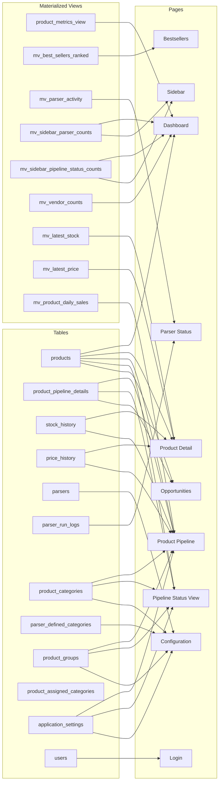

# Page-by-Page Analysis — Data Flow from Database to UI

> Every page's API endpoint, filters, DB tables/views, and displayed data fields.

---

## 1. Login Page (`/login`)

**File**: [Login.tsx](file:///c:/Users/Admin/Desktop/ecommerce%20revamp/frontend/src/pages/Login.tsx) (120 lines)

**API Calls**:
| Action | Endpoint | Method |
|---|---|---|
| Sign in | `POST /api/auth/login` | FormData: username, password |
| Session check (on app load) | `GET /api/auth/check` | Cookie |

**DB Tables Used**: `users` — queries by `username`, verifies `hashed_password` (bcrypt)

**Displays**: Username/password form with glassmorphism styling. Sets httpOnly JWT cookie on success, redirects to `/`.

---

## 2. Dashboard (`/`)

**File**: [Dashboard.tsx](file:///c:/Users/Admin/Desktop/ecommerce%20revamp/frontend/src/pages/Dashboard.tsx) (505 lines)

**API Calls**:
| Action | Endpoint | Method |
|---|---|---|
| Load products | `GET /api/dashboard` | GET + query params |
| Toggle shortlist | `POST /api/products/{id}/shortlist` | POST |
| Change status | `PUT /api/products/{id}/status` | PUT + JSON body |
| Add to pipeline | `POST /api/product/{id}/move-to-new-status` | POST |
| Refresh data | `POST /api/dashboard/refresh` | POST |

**DB Tables/Views Used**:
| Source | What it provides |
|---|---|
| **`product_metrics_view`** (MV) | All product rows: name, url, image, vendor, parser_name, stock, stock_diff, price, avg_1d/7d/30d, is_stale |
| **`products`** (table) | pipeline_status, shortlisted, sales_ranking (joined at API level) |
| **`mv_sidebar_parser_counts`** (MV) | Parser list with product counts for sidebar dropdown |
| **`mv_sidebar_pipeline_status_counts`** (MV) | Flow status counts (New, Approved, etc.) |
| **`mv_vendor_counts_all`** / **`mv_vendor_counts_by_parser`** (MV) | Vendor dropdown options |
| **`application_settings`** (table) | `DEFAULT_PAGE_SIZE` for pagination |

**Filters** (8 total, all in URL query params):
- `name_filter` → ILIKE on product name
- `vendor_filter` → exact match
- `pipeline_status_filter` → exact match on products.pipeline_status
- `sales_ranking_filter` → exact match on products.sales_ranking
- `min_price` / `max_price` → range on product_metrics_view.price
- `min_stock` / `max_stock` → range on product_metrics_view.stock
- `exclude_stale` → filters `is_stale = false` (default ON)
- `parser_id` → filter by parser, or `watchlist` for shortlisted products

**Sortable Columns** (12): name, parser_name, vendor, pipeline_status, sales_ranking, stock, stock_diff, avg_1d, avg_7d, avg_30d, avg_sold_over_period, price

**Displayed per row**: Image, Name (link to detail), Parser, Vendor, Pipeline Status (color-coded inline dropdown), Sales Ranking, Stock, Sold (stock_diff with red/green coloring), Avg 7D, Price, Actions (view detail, edit pipeline, toggle shortlist heart, add to pipeline)

---

## 3. Bestsellers (`/bestsellers`)

**File**: [Bestsellers.tsx](file:///c:/Users/Admin/Desktop/ecommerce%20revamp/frontend/src/pages/Bestsellers.tsx) (478 lines)

**API Calls**:
| Action | Endpoint | Method |
|---|---|---|
| Load bestsellers | `GET /api/bestsellers` | GET + query params |
| Refresh MVs | `POST /api/bestsellers/refresh` | POST |
| Toggle shortlist | `POST /api/products/{id}/shortlist` | POST |
| Add to pipeline | `POST /api/product/{id}/move-to-new-status` | POST |

**DB Tables/Views Used**:
| Source | What it provides |
|---|---|
| **`mv_best_sellers_ranked`** (MV) | product_id, name, image, url, vendor, parser_name, ads7_cal, ads30_cal, rnk_global_ads30, rnk_store_ads30, latest_stock, price, last_sold_day |
| **`products`** (table) | pipeline_status, shortlisted (joined) |
| **`parsers`** (table) | Parser dropdown list |
| **`mv_product_daily_sales`** (MV) | Underlying data for ADS calculations |
| **`mv_latest_stock`** / **`mv_latest_price`** (MVs) | Stock/price in ranked view |

**Filters** (8): keywords (full-text search via `websearch_to_tsquery('public.romanian_unaccent')`), parser_ids, vendors, top_n (rank ≤ N), stock_status (in_stock/out_of_stock), min/max_price, min/max_ads30

**Displayed per row**: Image (with hover preview popup), Global Rank (indigo badge), Store Rank (cyan badge), Name, Store, Vendor, Stock, Price, ADS 30 (bold), Last Sold date, Actions (edit pipeline, shortlist, add to pipeline, "In Pipeline" badge)

---

## 4. Product Detail (`/product/:productId`)

**File**: [ProductDetail.tsx](file:///c:/Users/Admin/Desktop/ecommerce%20revamp/frontend/src/pages/ProductDetail.tsx) (342 lines)

**API Calls**:
| Action | Endpoint |
|---|---|
| Load product | `GET /api/product/{id}` |

**DB Tables/Views Used**:
| Source | What it provides |
|---|---|
| **`products`** (table) | id, name, url, image, vendor |
| **`parsers`** (table) | parser name (joined) |
| **`mv_latest_stock`** (MV) | Current stock level |
| **`mv_latest_price`** (MV) | Current price |
| **`stock_history`** (table) | Full stock time-series for chart |
| **`price_history`** (table) | Full price time-series for chart |

**Displays**:
- Product header card: image, name, current stock, price (RON), store, vendor
- "Visit Store" + "Pipeline Details" action buttons
- **Stock History chart** (Chart.js Line, indigo fill) with date range filter (All/7d/30d/90d/Custom)
- **Price History chart** (Chart.js Line, emerald fill) with independent date range filter
- Both charts use `useMemo` for filtered data optimization

---

## 5. Product Pipeline (`/product/:productId/pipeline-details`)

**File**: [ProductPipeline.tsx](file:///c:/Users/Admin/Desktop/ecommerce%20revamp/frontend/src/pages/ProductPipeline.tsx) (758 lines) — **largest page**

**API Calls**:
| Action | Endpoint | Method |
|---|---|---|
| Load pipeline | `GET /api/product/{id}/pipeline-details` | GET |
| Save pipeline | `POST /api/product/{id}/pipeline-details` | POST JSON |
| Generate seasonality | `POST /api/product/{id}/seasonality/generate` | POST |
| Autofill TARIC | `POST /api/product/{id}/financial-review/autofill` | POST |

**DB Tables/Views Used**:
| Source | What it provides |
|---|---|
| **`products`** (table) | id, name, image, url, pipeline_status, group_id |
| **`product_pipeline_details`** (table) | All 20+ pipeline fields: title, sku, barcode, specs, retail_price, cogs_usd, transport_usd, customs_rate_percentage, hs_code, dimensions, cubic_meters, factory_link_url, top_keywords, keyword_difficulty, main_competitors, market_research_insights, suggested_quantity_min/max, first_order_cost_estimate, launch_notes, monthly_sales_index (JSONB), variants (JSONB) |
| **`product_assigned_categories`** (M2M table) | Category assignments |
| **`product_categories`** (table) | Category list for multi-select |
| **`product_groups`** (table) | Group dropdown |
| **`parsers`** (table) | Parser name |
| **`stock_history`** (table) | Stock chart data |
| **`price_history`** (table) | Price chart data |
| **`mv_latest_stock`** (MV) | Current stock |
| **`mv_latest_price`** (MV) | Current price |
| **`mv_product_daily_sales`** (MV) | Avg daily sales (30d) |
| **`application_settings`** (table) | VAT_RATE, USD_TO_RON for margin calculation |

**Displays** (progressive disclosure by status):
- **Header**: Image, title, SKU, barcode, link to source, price/stock/avgDailySales/grossMargin metrics
- **Stock sparkline** → click expands to modal with stock + price charts + date range filter
- **Key Financials panel**: Retail price (with "use live price" button), group selector, landed cost (auto-calculated: `(COGS + Transport) × (1 + customs%)`)
- **Seasonality panel**: Bar chart (12 months, 0-100), Generate button (calls Gemini AI), high-demand months summary
- **New section**: Product specs textarea, category multi-select (SearchableSelect component)
- **Supplier Info section**: Factory link, COGS (USD), transport (USD/unit), dimensions (W×L×H cm), volume (m³)
- **Financial Review section**: Customs %, HS code, landed cost, TARIC Autofill button (calls Gemini AI)
- **Market Research section**: Top keywords, main competitors, market insights textareas
- **Approved section**: Min/max quantity, first order cost, launch notes
- **Hold/Discarded sections**: Notes/reason textareas
- **Action buttons**: Save, Save & Process → (advances status), Approve, Discard

---

## 6. Pipeline Status View (`/pipeline/:statusSlug`)

**File**: [PipelineStatusView.tsx](file:///c:/Users/Admin/Desktop/ecommerce%20revamp/frontend/src/pages/PipelineStatusView.tsx) (317 lines)

**API Calls**:
| Action | Endpoint |
|---|---|
| Load products | `GET /api/pipeline/{statusSlug}` |
| Export Excel | `GET /api/pipeline/{statusSlug}/export-excel` |

**DB Tables/Views Used**:
| Source | What it provides |
|---|---|
| **`products`** (table) | id, image, pipeline_status, sales_ranking, group_id |
| **`product_pipeline_details`** (table) | title, retail_price, cogs_usd, transport_usd, customs_rate_percentage, suggested_quantity_min/max, top_keywords |
| **`product_assigned_categories`** + **`product_categories`** | Category display string |
| **`product_groups`** (table) | Group name |
| **`parsers`** (table) | Parser source name |
| **`application_settings`** (table) | VAT_RATE, USD_TO_RON, margin thresholds → server-side gross margin + margin_health calculation |

**Filters** (14): title, parser_id, category_id, group_id, sales_rank, margin_health (Healthy/Average/Low), seasonality month, top keyword, min/max retail price, min/max COGS, min/max suggested qty

**Displayed per row**: Image, ID, Title, Parser, Group, Sales Rank, Categories, Retail Price (RON), COGS (USD), Gross Margin % (color-coded), Margin Health badge (emerald/amber/red), Suggested Qty range, Edit action
- Status tabs at top for quick navigation between pipeline stages
- Excel export button

---

## 7. Opportunities (`/opportunities`)

**File**: [Opportunities.tsx](file:///c:/Users/Admin/Desktop/ecommerce%20revamp/frontend/src/pages/Opportunities.tsx) (258 lines)

**API Calls**:
| Action | Endpoint | Method |
|---|---|---|
| Load opportunities | `GET /api/opportunities` | GET |
| Batch generate seasonality | `POST /api/opportunities/generate-seasonality` | POST |
| Export Excel | `GET /api/opportunities/export-excel` | GET (blob download) |
| Toggle shortlist | `POST /api/products/{id}/shortlist` | POST |

**DB Tables/Views Used**:
| Source | What it provides |
|---|---|
| **`products`** (table) | Filtered: `shortlisted=True OR pipeline_status='New'` — id, name, image, url, shortlisted, pipeline_status |
| **`product_pipeline_details`** (table) | monthly_sales_index (JSONB) for seasonality chart, has_seasonality flag |
| **`stock_history`** (table) | Used in Excel export for historical data |
| **`application_settings`** (table) | `SEASONALITY_DEMAND_THRESHOLD` for "good months" calculation |

**Displays**:
- Action bar: "Generate Seasonality (N pending)" button, "Export to Excel" button
- Summary: counts of products with/without seasonality data
- Table: Image, Product name (link to pipeline), Status badge, Watchlist heart toggle, **Seasonality mini bar chart** (12 bars, emerald for high/indigo for normal), Actions (pipeline link, visit store)

---

## 8. Parser Status (`/parser-status`)

**File**: [ParserStatus.tsx](file:///c:/Users/Admin/Desktop/ecommerce%20revamp/frontend/src/pages/ParserStatus.tsx) (213 lines)

**API Calls**:
| Action | Endpoint |
|---|---|
| Load parser data | `GET /api/parser-status` |

**DB Tables/Views Used**:
| Source | What it provides |
|---|---|
| **`mv_parser_activity`** (MV) | parser_id, parser_name, parser_category, total_products, products_with_stock_history, products_updated_24h, products_updated_48h, latest_stock_update |
| **`parser_run_logs`** (table) | Latest run per parser: status, started_at, success_rate (server-side: last_run_status, hours_since) |

**Server-Side Computed Fields**:
- **Run Status**: Healthy (<30h since last run) / Warning (<48h) / Stale / Running / Error
- **Activity Status**: Active (>50% updated 24h) / Partial (10-50%) / Stale (<10% in 24h, some in 48h) / Inactive (<10% in 48h)

**Displayed per row**: Parser name + category, Run Status badge, Activity badge, Total products, 24h updates (emerald if >0), 48h updates, Coverage % (progress bar: emerald ≥80%, yellow ≥50%, orange ≥20%, red <20%), Last stock update (relative time)

**Legend** at bottom explains activity color coding.

---

## 9. Configuration (`/config`)

**File**: [Config.tsx](file:///c:/Users/Admin/Desktop/ecommerce%20revamp/frontend/src/pages/Config.tsx) (454 lines)

**API Calls**:
| Action | Endpoint | Method |
|---|---|---|
| Load all config | `GET /api/config/data` | GET |
| Create product category | `POST /api/config/product-categories` | POST JSON |
| Create parser category | `POST /api/config/parser-defined-categories` | POST JSON |
| Create product group | `POST /api/config/product-groups` | POST JSON |
| Assign parser categories | `POST /api/config/parsers/assign-categories` | POST JSON |
| Update setting | `POST /api/config/application-settings/update-via-form` | POST FormData |
| Trigger sales rankings | `POST /api/config/tasks/update-sales-rankings` | POST |

**DB Tables Used**:
| Source | What it provides |
|---|---|
| **`product_categories`** | CRUD list (id, name, code) |
| **`parser_defined_categories`** | CRUD list (id, name) |
| **`product_groups`** | CRUD list (id, name) |
| **`parsers`** | All parsers for category assignment (id, name, category) |
| **`application_settings`** | All 20 settings (key, value, type, description) |
| **`products`** + **`mv_product_daily_sales`** | Used by sales ranking task to recalculate |

**3 Tabs**:
1. **Categories & Groups**: Three columns — Product Categories (name+code, create form), Parser Categories (name, create form), Product Groups (name, create form)
2. **Parser Assignments**: Table of all parsers with dropdown to assign parser_defined_category, bulk save
3. **Application Settings**: Table with inline edit (click pencil → input → Enter/blur saves), "Update Sales Rankings" button

---

## 10. Sidebar (Persistent)

**File**: [Sidebar.tsx](file:///c:/Users/Admin/Desktop/ecommerce%20revamp/frontend/src/components/Layout/Sidebar.tsx) (196 lines)

**API Calls** (via SidebarContext):
| Action | Endpoint |
|---|---|
| Load sidebar data | `GET /api/sidebar` |

**DB Tables/Views Used**:
| Source | What it provides |
|---|---|
| **`mv_sidebar_parser_counts`** (MV) | Parser id, name, category, product_count — grouped by category for collapsible tree |
| **`mv_sidebar_pipeline_status_counts`** (MV) | Pipeline status → count (for flow section badges) |

**Displays**:
- **Header**: Logo + "E-commerce Analytics"
- **All Products** nav link
- **Parsers section**: Watchlist link (`/?parser_id=watchlist`), collapsible category groups → individual parser links with product count badges
- **Flow section**: Opportunities link, pipeline status links (`/pipeline/{slug}`) with count badges
- **System section**: Best Sellers, Parser Status, Configuration links
- **Sign Out** button

**Caching**: SidebarContext loads from `localStorage` instantly, then refreshes in background. Optimistic count updates on status changes.

---

## Data Source Summary by Page

