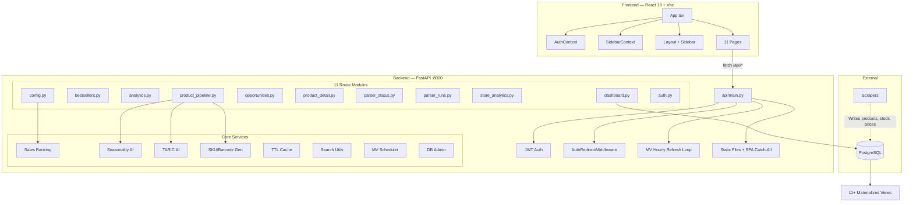
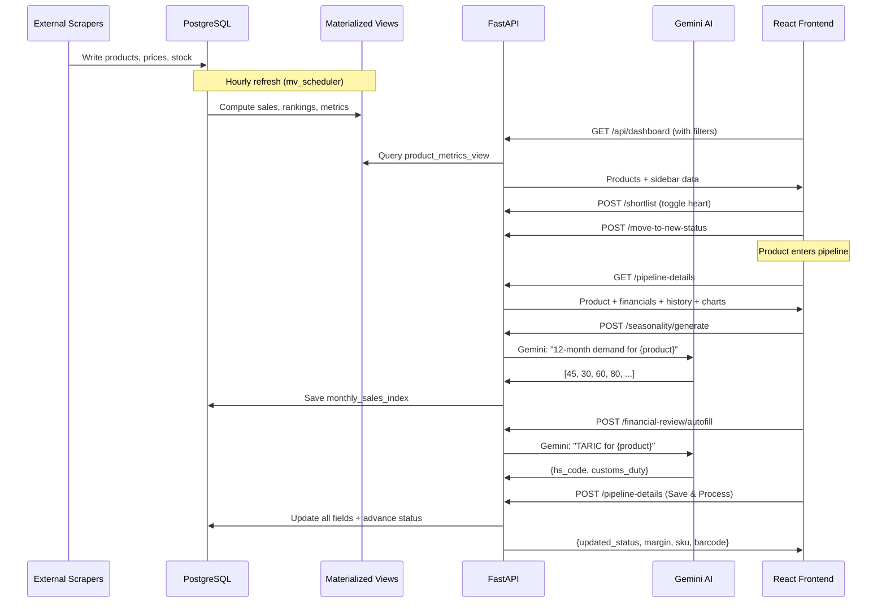

# E-commerce BI Platform — Deep Analysis

> Run with: `uvicorn api.main:app --port 8000`

---

## Architecture Overview

---

## Backend Deep Dive

### 1. Application Entry Point

[main.py](file:///c:/Users/Admin/Desktop/ecommerce%20revamp/api/main.py):
- Mounts static files (`/static` → `api/static/`)
- Mounts built React files (`/app` → `api/frontend_dist/`)
- CORS origins: `localhost:8000`, `localhost:5173` (Vite dev)
- `AuthRedirectMiddleware` for HTML 401 → `/login` redirects
- **Startup event**: Launches `run_daily_refresh_loop()` as an async background task (hourly MV refresh)
- **SPA catch-all**: `/{path:path}` serves `index.html` for React Router; dev mode redirects to `localhost:5173`

### 2. Authentication

[auth.py](file:///c:/Users/Admin/Desktop/ecommerce%20revamp/api/routes/auth.py) (167 lines):

| Mechanism | Detail |
|---|---|
| Token format | JWT (HS256), stored in httpOnly cookie `access_token` |
| Expiry | 10 hours (`ACCESS_TOKEN_EXPIRE_MINUTES = 600`) |
| Password hashing | bcrypt via `bcrypt.gensalt()` |
| Auth guard | `get_current_user(request, db)` — reads cookie, decodes JWT, fetches User from DB |
| Endpoints | `POST /api/auth/login` (form data → set cookie), `GET /api/auth/check` (session validation), `POST /auth/register`, `POST /auth/token` (OAuth2 token grant), `GET /auth/logout` |

### 3. Database Layer

[session.py](file:///c:/Users/Admin/Desktop/ecommerce%20revamp/db/session.py): SQLAlchemy `create_engine` + `sessionmaker`, synchronous. Default: PostgreSQL at `38.242.226.83:5432/test`.

[models.py](file:///c:/Users/Admin/Desktop/ecommerce%20revamp/db/models.py) — 10 models:

| Model | Key Fields | Notes |
|---|---|---|
| `Product` | name, url, image, vendor, stock_policy, shortlisted, pipeline_status, sales_ranking, group_id | Core entity, FK to Parser |
| `ProductPipelineDetail` | cogs_usd, transport_usd, customs_rate_percentage, hs_code, monthly_sales_index (JSONB), variants (JSONB), specs, sku, barcode, dimension_*, suggested_quantity_*, top_keywords, market_research_insights | One-to-one with Product |
| `PriceHistory` | product_id, value, timestamp | Time-series |
| `StockHistory` | product_id, quantity, timestamp | Time-series; sales = stock decrease |
| `Parser` | name, url, category | Source registry |
| `ProductCategory` | name, code | M2M with Product via `product_assigned_categories` |
| `ProductGroup` | name | FK'd from Product.group_id |
| `ParserRunLog` | parser_id, run_date, products_found/parsed_success/failed, stock/price_entries_saved, started_at, finished_at, duration_seconds, status, speed | Scraper run metrics |
| `ApplicationSetting` | setting_key, setting_value, value_type, description | Typed key-value config store |
| `User` | username, hashed_password | Auth |

### 4. Materialized Views (11+)

Defined in [sql/](file:///c:/Users/Admin/Desktop/ecommerce%20revamp/sql), refreshed hourly by `mv_scheduler.py`:

| MV | Built From | Purpose |
|---|---|---|
| `mv_latest_stock` | stock_history | Most recent stock per product |
| `mv_latest_price` | price_history | Most recent price per product |
| `mv_stock_last_per_day` | stock_history | Last stock reading per product per day |
| `mv_product_daily_sales` | mv_stock_last_per_day | Daily sold units = `LAG(stock) - stock` where decrease |
| `product_metrics_view` | All above MVs + products + parsers + settings | **Dashboard main view**: stock, price, avg_1d/7d/30d, stock_diff, `is_stale` (14-day zero-stock/no-update detection) |
| `mv_parser_activity` | parsers + stock_history | Per-parser: total products, products updated 24h/48h, latest update |
| `mv_sidebar_parser_counts` | parsers + products | Parser names + product counts for sidebar |
| `mv_sidebar_pipeline_status_counts` | products | Pipeline status counts |
| `mv_vendor_counts_all` | products | Vendor → product count |
| `mv_vendor_counts_by_parser` | products | Vendor counts scoped to parser |
| `mv_best_sellers` / `mv_best_sellers_ranked` | daily_sales + stock + price | ADS7/ADS30, global + store rank |
| `store_analytics_mv` | (created separately) | Per-store revenue, sell-through, DOI |

All MVs use `REFRESH MATERIALIZED VIEW CONCURRENTLY` with fallback to blocking refresh. Unique indexes required for concurrent refresh.

### 5. Dashboard API

[dashboard.py](file:///c:/Users/Admin/Desktop/ecommerce%20revamp/api/routes/dashboard.py) (382 lines):

**`GET /api/dashboard`** — The primary product grid endpoint:
- Reads from `product_metrics_view` (no raw table joins needed)
- **12 sort columns**: name, parser_name, vendor, pipeline_status, sales_ranking, stock, stock_diff, avg_1d, avg_7d, avg_30d, avg_sold_over_period, price
- **Filters**: parser_id, name (ILIKE), vendor, pipeline_status, sales_ranking, min/max_price, min/max_stock, exclude_stale (default ON)
- **Watchlist mode**: `parser_id=watchlist` filters to `shortlisted=True` and auto-disables stale filtering
- Pagination: configurable page size from `ApplicationSetting`, default 50
- Returns sidebar context (parsers + pipeline flow counts) piggy-backed in response

**`POST /api/products/{id}/shortlist`** — Toggles `product.shortlisted` (boolean flip)
**`PUT /api/products/{id}/status`** — Updates pipeline status directly
**`POST /api/product/{id}/move-to-new-status`** — Shortlists + sets status to "New"
**`POST /api/dashboard/refresh`** — Refreshes `product_metrics_view` + sidebar MVs

### 6. Bestsellers API

[bestsellers.py](file:///c:/Users/Admin/Desktop/ecommerce%20revamp/api/routes/bestsellers.py) (209 lines):

**`GET /api/bestsellers`** — Ranked products from `mv_best_sellers_ranked`:
- Full-text search with `websearch_to_tsquery('public.romanian_unaccent', :keywords)`
- Filters: parser_ids, vendors, keywords, top_n (rank ≤ N), stock_status, price range, ADS30 range
- Sort: 10 columns mapped to safe SQL identifiers
- Returns: products, vendor filter list, parser list, pagination, last refresh timestamp
- Tracks last refresh via PostgreSQL `COMMENT ON MATERIALIZED VIEW`

**`POST /api/bestsellers/refresh`** — Refreshes 6 MVs in dependency order

### 7. Analytics API

[analytics.py](file:///c:/Users/Admin/Desktop/ecommerce%20revamp/api/routes/analytics.py) (138 lines):

Four raw SQL CTE queries, all for 30-day window:
1. **Sold data** — Stock decreases per parser per day
2. **Revenue** — Units sold × price at time of sale (correlated subquery for price lookup)
3. **Stock trends** — End-of-day total stock per parser
4. **Inventory valuation** — Total units × latest price per parser

### 8. Product Pipeline API

[product_pipeline.py](file:///c:/Users/Admin/Desktop/ecommerce%20revamp/api/routes/product_pipeline.py) (703 lines) — the **largest and most complex** module:

**`GET /api/product/{id}/pipeline-details`** — Returns product + pipeline details + stock/price history + categories + groups + current metrics (stock, price, avg daily sales, gross margin)

**`POST /api/product/{id}/pipeline-details`** — Saves all pipeline fields:
- Updates `ProductPipelineDetail` (creates if missing)
- Updates product categories (M2M sync)
- Updates product group assignment
- Transitions pipeline status
- Auto-generates SKU + barcode on first category assignment
- Calculates gross margin: `(retail_no_vat - landed_cost_ron) / retail_no_vat * 100`
  - `retail_no_vat = retail_price / (1 + VAT_RATE/100)`
  - `landed_cost_ron = (cogs_usd + transport_usd) * (1 + customs/100) * USD_TO_RON`

**`POST /api/product/{id}/seasonality/generate`** — Calls Gemini AI → saves 12-element JSONB array

**`POST /api/product/{id}/financial-review/autofill`** — Calls Gemini TARIC → saves hs_code + customs_rate

**`PATCH /api/product/{id}/key-data`** — Inline edit for title/variants

**`GET /api/pipeline/{status_slug}`** — Status-filtered product list with 15+ filter dimensions:
- margin_health (healthy/average/low), seasonality_month, category, group, keyword, price range, min_margin
- Server-side gross margin calculation for each row
- Excel export via `GET /api/pipeline/{status_slug}/export`

### 9. Opportunities API

[opportunities.py](file:///c:/Users/Admin/Desktop/ecommerce%20revamp/api/routes/opportunities.py) (181 lines):
- `GET /api/opportunities` — Products where `shortlisted=True OR pipeline_status='New'`
- `POST /api/opportunities/generate-seasonality` — Batch Gemini calls for all products missing seasonality
- `GET /api/opportunities/export-excel` — Excel with stock history + good-months (threshold from settings)

### 10. Parser Status & Runs

[parser_status.py](file:///c:/Users/Admin/Desktop/ecommerce%20revamp/api/routes/parser_status.py) (237 lines):
- Joins `parser_run_logs` (latest run) with `mv_parser_activity` (stock update recency)
- **Dual health system**:
  - **Run status**: Healthy (<30h) / Warning (<48h) / Stale / Running / Error
  - **Activity status**: Active (>50% updated 24h) / Partial (>10%) / Stale / Inactive / No Data

[parser_runs.py](file:///c:/Users/Admin/Desktop/ecommerce%20revamp/api/routes/parser_runs.py) (132 lines):
- `GET /api/parser-runs` — Latest 100 runs across all parsers
- `GET /api/parser-runs/{parser_id}` — Last 30 runs for specific parser

### 11. Store Analytics API

[store_analytics.py](file:///c:/Users/Admin/Desktop/ecommerce%20revamp/api/routes/store_analytics.py) (105 lines):
- Reads `store_analytics_mv` — per-store KPIs: revenue_30d, avg_order_value, sold_30d, restocked_30d, sell_through_rate, days_of_inventory, active_sku_ratio, stock_turn, revenue_per_active_sku
- Grand totals calculated server-side
- On-demand refresh via POST

### 12. Configuration API

[config.py](file:///c:/Users/Admin/Desktop/ecommerce%20revamp/api/routes/config.py) (424 lines):
- Full CRUD: Product Categories, Parser-Defined Categories, Product Groups
- Bulk parser→category assignments
- Application Settings with 20 default keys (in [settings_utils.py](file:///c:/Users/Admin/Desktop/ecommerce%20revamp/db/settings_utils.py)):

| Setting Key | Default | Purpose |
|---|---|---|
| VAT_RATE | 19.0 | Romanian VAT for margin calc |
| USD_TO_RON_CONVERSION_RATE | 4.60 | Pipeline cost conversion |
| SALES_AVG_PERIOD_DAYS | 30 | Dashboard averaging window |
| DECIMAL_HIGH_MARGIN_THRESHOLD | 50.0 | "Healthy" margin threshold |
| DECIMAL_AVERAGE_MARGIN_THRESHOLD_LOWER | 30.0 | "Average" margin threshold |
| SALES_RANKING_HIGH_MIN_AVG_UNITS | 3.0 | High rank: ≥3 units/day |
| SALES_RANKING_HIGH_MIN_DAYS_PERCENT | 75.0 | High rank: ≥75% days with sales |
| SALES_SANITY_CHECK_THRESHOLD | 10000 | Stock levels above this = placeholder |
| SALES_OUTLIER_MULTIPLIER | 10 | Day sales capped at median × 10 |
| DEFAULT_PAGE_SIZE | 50 | Pagination default |
| SEASONALITY_DEMAND_THRESHOLD | 50 | Months above this = "good" demand |

**`POST /config/tasks/update-sales-rankings`** — Triggers background sales ranking recalculation

### 13. Core Services

**Sales Ranking** ([sales_ranking_service.py](file:///c:/Users/Admin/Desktop/ecommerce%20revamp/api/core/sales_ranking_service.py)):
- Single CTE-based `UPDATE` query that ranks ALL products in one pass
- Reads thresholds from ApplicationSetting, classifies: High → Good → Slow → Poor
- Uses `mv_product_daily_sales` for sales data

**Seasonality AI** ([seasonality_service.py](file:///c:/Users/Admin/Desktop/ecommerce%20revamp/api/core/seasonality_service.py)):
- Model: `gemini-2.5-flash-lite`
- Prompt: "Expert on Romanian market demand patterns" → returns 12 integers (0-100)
- Async call via `client.aio.models.generate_content()`
- Background task mode for batch processing

**TARIC AI** ([taric_service.py](file:///c:/Users/Admin/Desktop/ecommerce%20revamp/api/core/taric_service.py)):
- Same model, prompt: "EU TARIC customs expert, product from China to Romania"
- Returns: 10-digit HS code + customs duty percentage
- JSON extraction via regex from response text

**TTL Cache** ([cache_utils.py](file:///c:/Users/Admin/Desktop/ecommerce%20revamp/api/core/cache_utils.py)):
- Thread-safe in-memory cache with `Lock`
- Sidebar TTL: 60s, Dashboard TTL: 30s
- Prefix-based invalidation

**MV Scheduler** ([mv_scheduler.py](file:///c:/Users/Admin/Desktop/ecommerce%20revamp/api/core/mv_scheduler.py)):
- Refreshes 11 MVs in dependency order every hour
- Checks each MV exists via `pg_matviews` before refresh
- Falls back from CONCURRENT to blocking if needed

**Search Utils** ([search_utils.py](file:///c:/Users/Admin/Desktop/ecommerce%20revamp/api/core/search_utils.py)):
- Romanian diacritics stripping (ă→a, ș→s, ț→t)
- Tokenization + `tsquery` prefix-and builder for PostgreSQL full-text search

**Product Codification** ([product_codification_service.py](file:///c:/Users/Admin/Desktop/ecommerce%20revamp/api/core/product_codification_service.py)):
- Barcode: EAN-13 format `5941237` + 5-digit product ID + check digit
- SKU: `GD-{CategoryCode}-{ProductID}`

---

## Frontend Deep Dive

### App Structure

[App.tsx](file:///c:/Users/Admin/Desktop/ecommerce%20revamp/frontend/src/App.tsx) (127 lines):
- `QueryClientProvider` (React Query, 5min stale time)
- `BrowserRouter` → `AuthProvider` → `AppRoutes`
- `ProtectedRoute` wrapper: checks `useAuth()` → renders `<Layout>` or redirects to `/login`

### Contexts

**AuthContext** — Session management:
- On mount: `GET /api/auth/check` to validate existing cookie
- `login()`: `POST /api/auth/login` with FormData → sets cookie
- `logout()`: `GET /auth/logout` → navigates to `/login`

**SidebarContext** — Sidebar data with stale-while-revalidate:
- **Load from localStorage** immediately on mount (instant render)
- **Background refresh** via `GET /api/sidebar` always runs
- **Optimistic updates**: `updateFlowCount(fromSlug, toSlug)` adjusts counts client-side before server confirmation
- Cache persisted to localStorage after each fetch

### Layout & Sidebar

[Sidebar.tsx](file:///c:/Users/Admin/Desktop/ecommerce%20revamp/frontend/src/components/Layout/Sidebar.tsx) (196 lines):
- **Logo** + "E-commerce Analytics" branding
- **All Products** link (home)
- **Parsers section**: Watchlist link + collapsible category groups with per-parser links (`/?parser_id={id}`) showing product count badges
- **Flow section**: Opportunities link + pipeline status links (`/pipeline/{slug}`) with count badges
- **System section**: Best Sellers, Parser Status, Configuration
- Tailwind dark theme (slate-900 bg, indigo-600 active states)

### API Client

[api/index.ts](file:///c:/Users/Admin/Desktop/ecommerce%20revamp/frontend/src/api/index.ts) (124 lines):
- Axios instance with `withCredentials: true` (sends cookies)
- 15 exported functions covering all backend endpoints
- All data fetching proxied through this module

### Pages Summary

| Page | Lines | Key Behaviors |
|---|---|---|
| [Dashboard.tsx](file:///c:/Users/Admin/Desktop/ecommerce%20revamp/frontend/src/pages/Dashboard.tsx) | 505 | Product grid with 8 filter fields, 12 sortable columns, pagination with ellipsis, inline pipeline status dropdown (color-coded), shortlist heart toggle, "Add to Pipeline" button, stale product checkbox (default ON), refresh button |
| [ProductPipeline.tsx](file:///c:/Users/Admin/Desktop/ecommerce%20revamp/frontend/src/pages/ProductPipeline.tsx) | 758 | **Full sourcing workbench**: product header with SKU/barcode, stock sparkline (click→modal with date range filters), key financials panel with live landed-cost calculation, seasonality bar chart with generate button, **progressive disclosure** — sections appear based on status (New→Supplier→Financial→Market→Approved), TARIC autofill button, Save/Process/Approve/Discard action buttons, Chart.js Line+Bar charts |
| [Bestsellers.tsx](file:///c:/Users/Admin/Desktop/ecommerce%20revamp/frontend/src/pages/Bestsellers.tsx) | 478 | Ranked table with global+store rank badges, full-text keyword search, multi-filter (store/vendor/top-N/stock/price/ADS30), image hover preview popup, shortlist+pipeline actions, pagination |
| [ProductDetail.tsx](file:///c:/Users/Admin/Desktop/ecommerce%20revamp/frontend/src/pages/ProductDetail.tsx) | 342 | Product header card, side-by-side stock + price Line charts with independent date range filters (All/7d/30d/90d/Custom), breadcrumb nav, "Visit Store" + "Pipeline Details" links |
| [PipelineStatusView.tsx](file:///c:/Users/Admin/Desktop/ecommerce%20revamp/frontend/src/pages/PipelineStatusView.tsx) | ~20KB | Status-filtered product list, margin health indicators, filters, Excel export |
| [Config.tsx](file:///c:/Users/Admin/Desktop/ecommerce%20revamp/frontend/src/pages/Config.tsx) | ~23KB | Tabbed CRUD for categories/groups/parsers/settings, trigger sales ranking update |
| [Opportunities.tsx](file:///c:/Users/Admin/Desktop/ecommerce%20revamp/frontend/src/pages/Opportunities.tsx) | ~14KB | Shortlisted+New products, batch seasonality generation, Excel export |
| [ParserStatus.tsx](file:///c:/Users/Admin/Desktop/ecommerce%20revamp/frontend/src/pages/ParserStatus.tsx) | ~12KB | Parser health table with dual status (run + activity), expandable run history |
| [StoreAnalytics.tsx](file:///c:/Users/Admin/Desktop/ecommerce%20revamp/frontend/src/pages/StoreAnalytics.tsx) | ~12KB | Per-store KPI table (revenue, sell-through, DOI), sortable, refresh |
| [Analytics.tsx](file:///c:/Users/Admin/Desktop/ecommerce%20revamp/frontend/src/pages/Analytics.tsx) | ~11KB | Cross-store charts for sold/revenue/stock/inventory per parser |
| [Login.tsx](file:///c:/Users/Admin/Desktop/ecommerce%20revamp/frontend/src/pages/Login.tsx) | ~6KB | Form → `/api/auth/login`, redirects to `/` on success |

### UI Design System
- **Background**: `bg-slate-950` (main), `bg-slate-900` (sidebar)
- **Cards**: `bg-slate-800/50 backdrop-blur border border-slate-700/50 rounded-xl`
- **Active nav**: `bg-indigo-600 shadow-lg shadow-indigo-500/30`
- **Text**: white for primary, `text-slate-400` for secondary
- **Accent**: indigo-600 (primary), emerald (positive), red (negative), cyan (pipeline)

---

## Data Flow: Product Sourcing Lifecycle

